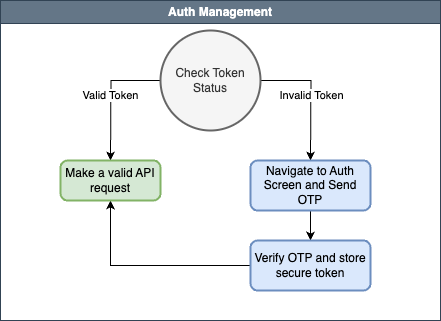
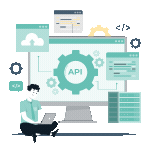
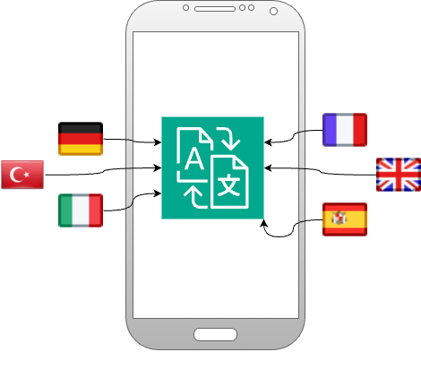
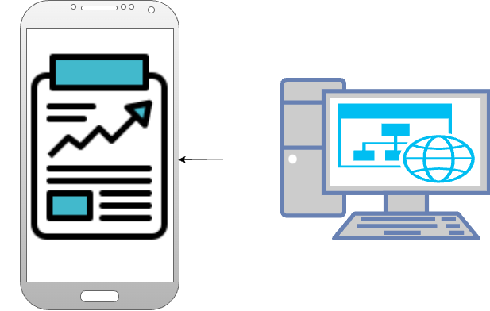
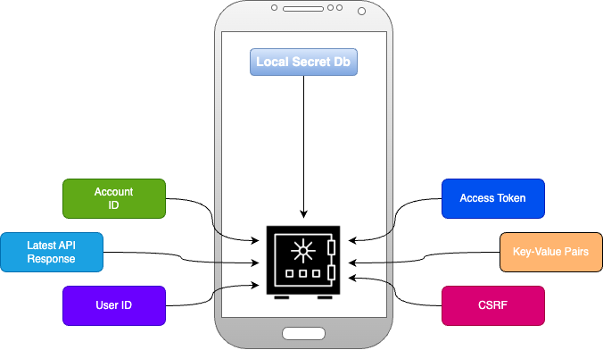
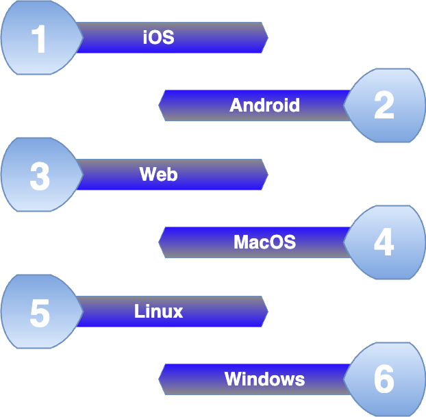

# PlusClouds Documentation

## Auth Management System

With PlusClouds' auth management system, the token stored securely on the user's device is verified against the system's token upon login. If the token is valid, the user can continue performing in-app transactions securely. In the event of token invalidation, a new token is issued to the user for verification, and once verified, a new token is assigned.

---

## Animation Support

PlusClouds utilizes Flutter's native animation library and also supports third-party animation providers like Lottie. Additionally, it offers custom animation support through its constantly evolving Custom Widget Library, enabling seamless creation of personalized animations tailored to individual users and projects. This capability enhances your application with unique animations, adding vibrancy and a polished touch to your projects.

---

## Animated Page Transition

With PlusClouds' animated page transition support, you can achieve significant advancements in UI/UX design while customizing page structures and transitions. It provides highly optimized solutions that enable smooth and visually appealing page transitions without compromising your application's performance, ensuring a seamless and engaging user experience.

---

## API Structure

PlusClouds provides everything you need in an API class, ready to use out of the box. The only adjustments required are updating the Auth and Base URL. It offers a customized function structure for every type of request, making API integration seamless. When adding a new API, all you need to specify are the function name, endpoint, and request type, streamlining the process significantly.

---

## Integrated Localization

PlusClouds' built-in language support enables you to publish your application in multiple languages effortlessly. It can automatically adapt the application's language based on the user's system settings, or you can allow seamless manual language switching, providing a versatile and user-friendly multilingual experience.

---

## Integrated Webview

With PlusClouds, integrating websites into your applications is as simple as providing a link. Additionally, it supports HTML content, offering you the flexibility to display custom web pages or embed dynamic content seamlessly within your app.

---

## Local DB

PlusClouds securely stores user data on the device in a way that cannot be altered or accessed directly. This ensures the safety of user information after OTP verification. Additionally, its high-performance capabilities allow it to cache reusable API requests, enabling you to utilize them without sending another request, enhancing efficiency and user experience.

---

## Platform Support

With the PlusClouds mobile module, the projects you create are supported across six platforms: iOS, Android, Web, Linux, macOS, and Windows. This allows you to build your application once and deploy it seamlessly to all six platforms, maximizing reach and efficiency.

